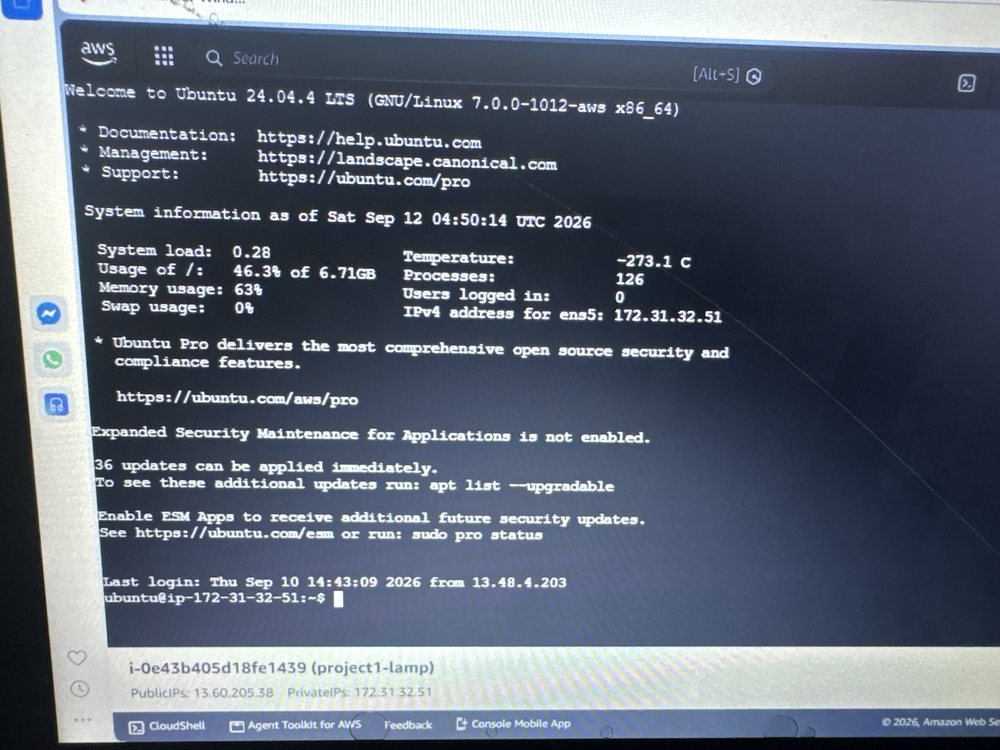
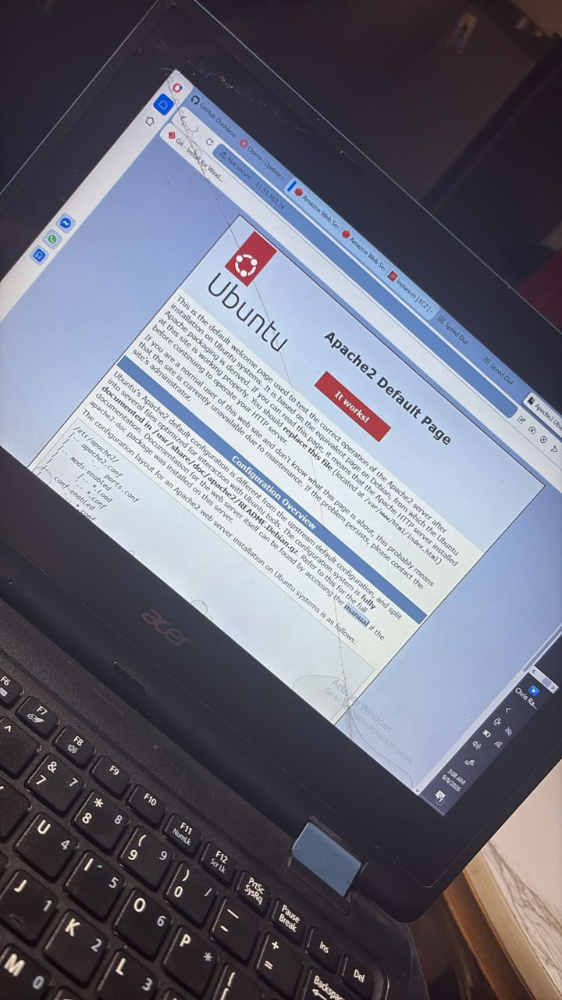
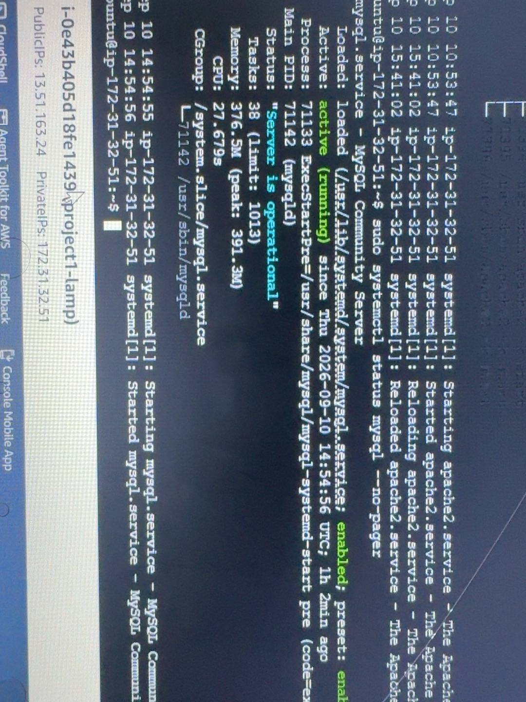
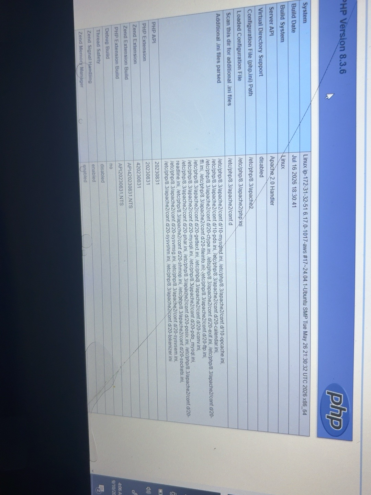
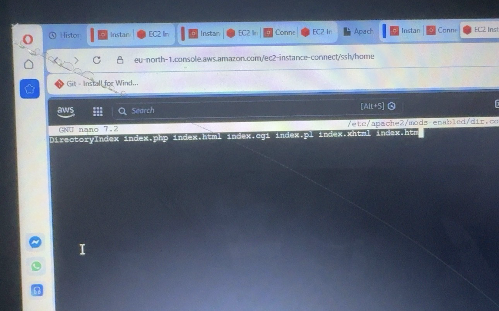
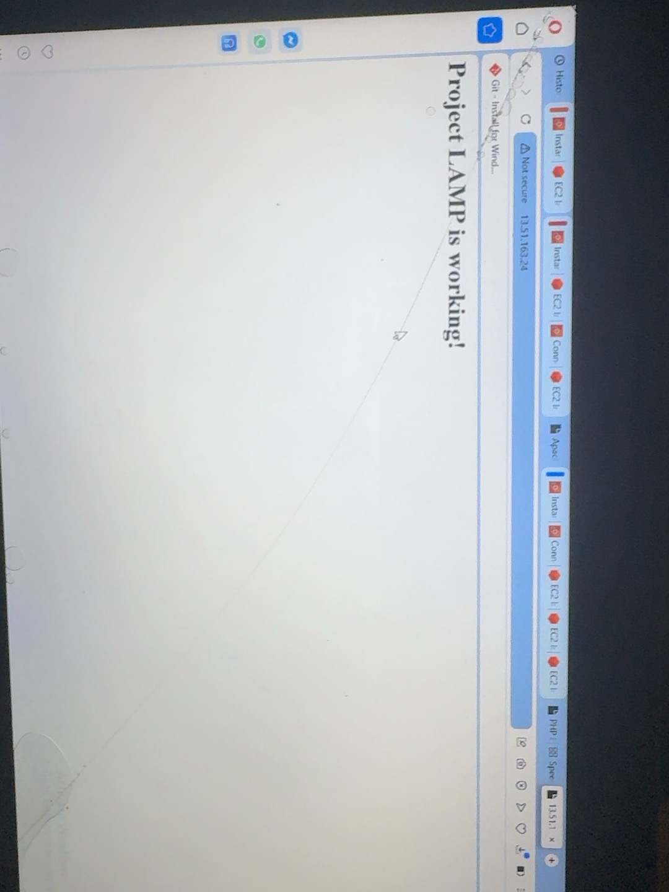

# DEVOPS PROJECT - PROJECT 1

# WEB STACK IMPLEMENTATION
## (LAMP STACK)

## PREPARING PREREQUISITES

For this project, an AWS EC2 instance was created using Ubuntu Server.

The EC2 instance was used as the server environment for implementing the LAMP stack.

The LAMP stack consists of:

- Linux
- Apache
- MySQL
- PHP

### AWS EC2 SERVER

The Ubuntu server was accessed through AWS EC2 Instance Connect.

# STEP 1 - INSTALLING THE APACHE WEB SERVER

Apache is the web server component of the LAMP stack. It is responsible for receiving HTTP requests and serving web pages to visitors.

First, the server's package index was updated.

    sudo apt update

Apache was then installed using:

    sudo apt install apache2

After installation, the Apache service was checked to verify that it was running.

    sudo systemctl status apache2

Apache was successfully installed and configured as the web server for the project.

## TESTING APACHE FROM THE INTERNET

TCP port 80 is the default port used by web browsers to access HTTP web pages.

The EC2 security group was configured to allow HTTP traffic through port 80.

The Apache server was then tested from a web browser using the public IP address of the EC2 instance.

The successful browser response confirmed that Apache was serving the project web page.

# STEP 2 - INSTALLING MYSQL

MySQL was installed as the database component of the LAMP stack.

The installation was performed using:

    sudo apt install mysql-server

After installation, the MySQL server was configured and tested.

MySQL was accessed through the MySQL console.

    sudo mysql -p

The MySQL service was also verified to ensure that it was running correctly.

## SECURING MYSQL

The MySQL security installation script was executed to improve the security of the database server.

    sudo mysql_secure_installation

During the configuration process:

* Password validation was configured.
* Anonymous users were removed.
* Remote root login was disabled.
* The test database was removed.
* Privilege tables were reloaded.

The security configuration was completed successfully.

# STEP 3 - INSTALLING PHP

PHP was installed to provide server-side processing for the website and allow PHP applications to communicate with MySQL.

The required PHP packages were installed using:

    sudo apt install php libapache2-mod-php php-mysql

The installed PHP version was verified using:

    php -v

The server was running PHP 8.3.6.

PHP was successfully installed and integrated with Apache.

# STEP 4 - CONFIGURING APACHE

A dedicated web root directory was created for the project.

    sudo mkdir /var/www/projectlamp

Ownership of the directory was assigned to the current user.

    sudo chown -R $USER:$USER /var/www/projectlamp

An Apache virtual host configuration was created for the Project LAMP website.

The configuration used the following structure:

    <VirtualHost *:80>
        ServerName projectlamp
        ServerAlias www.projectlamp
        ServerAdmin webmaster@localhost
        DocumentRoot /var/www/projectlamp

        ErrorLog ${APACHE_LOG_DIR}/error.log
        CustomLog ${APACHE_LOG_DIR}/access.log combined
    </VirtualHost>

The project site was enabled:

    sudo a2ensite projectlamp

The default Apache website was disabled:

    sudo a2dissite 000-default

The Apache configuration was tested for syntax errors:

    sudo apache2ctl configtest

The configuration returned:

    Syntax OK

Apache was then reloaded:

    sudo systemctl reload apache2

The Apache configuration was successfully applied.

# STEP 5 - CONFIGURING DIRECTORY INDEX

The Apache DirectoryIndex configuration was adjusted so that PHP index files could be prioritized.

The configuration file was:

    /etc/apache2/mods-enabled/dir.conf

The DirectoryIndex order was configured with:

    DirectoryIndex index.php index.html index.cgi index.pl index.xhtml index.htm

# STEP 6 - TESTING PHP

A PHP test file was created in the project web directory to verify that Apache could process PHP.

The PHP test contained:

    <?php
    phpinfo();
    ?>

The PHP page was accessed through the web browser using the server's public IP address.

The PHP information page confirmed that PHP was successfully being processed by the web server.

After testing, the PHP information file was removed because it contains detailed information about the server and PHP environment.

# STEP 7 - FINAL WEBSITE TEST

The Project LAMP website was accessed through the EC2 public IP address.

The browser successfully displayed the Project LAMP website.

This confirmed that the Apache web server and the configured Project LAMP virtual host were working successfully.

# CONCLUSION

The LAMP stack was successfully implemented on an AWS EC2 Ubuntu server.

The following components were installed and configured:

* Linux: Ubuntu Server
* Apache: Web server
* MySQL: Database server
* PHP: Server-side scripting language

Apache was configured with a dedicated project directory and virtual host.

The website was successfully accessed through the EC2 public IP address, confirming that the web server was operational.

The PHP environment was also tested successfully.

The Project 1 LAMP web stack implementation was therefore completed and verified.
